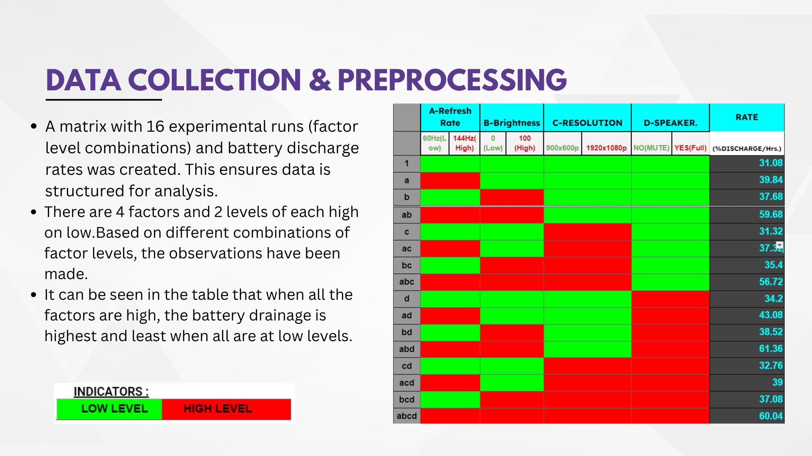
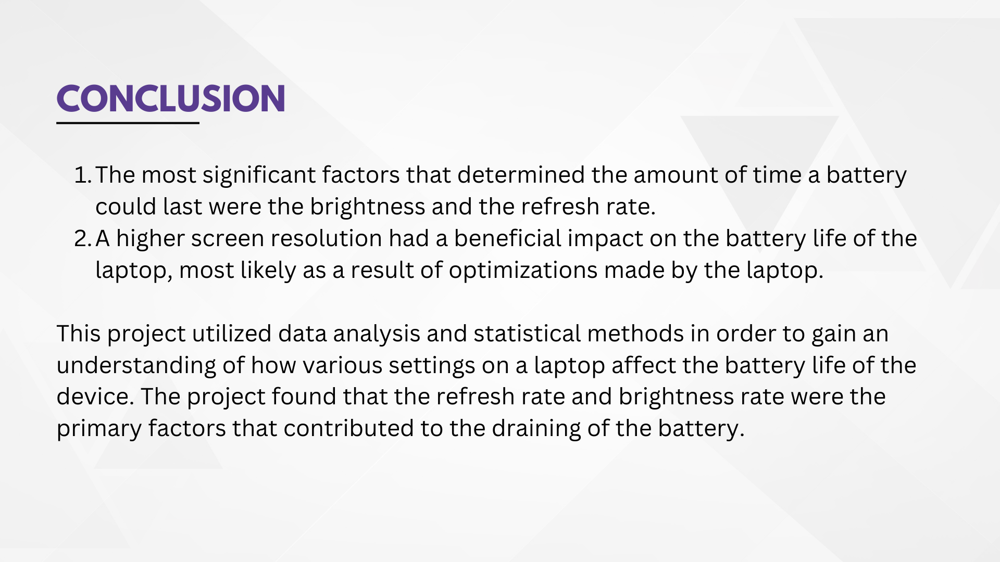

# Device-Battery-Life-Optimization-Analysis

This project involves an extensive analysis of battery life in electronic devices using  **RStudio** . Statistical methodologies such as **ANOVA** and **regression** were employed to evaluate the impact of various factors, including  **refresh rate** ,  **brightness** ,  **resolution** , and other performance-affecting variables. The result is a versatile framework aimed at optimizing battery performance across a range of devices.

## Code Repository

* **R Code** : [Link to R Code]()
* **Data Sheet** : [Google Sheets Link]()

### Problem Statement

Due to our frequent use of laptops for various activities, including data science projects and everyday tasks, we have noted significant variations in battery performance. This frequently results in disruptions to our workflow, particularly during travel or when away from a power source. We considered identifying the factors that significantly influence battery life, which we can modify to extend the longevity of my batteries. As we  suspected that certain factors like the display refresh rate, brightness levels, sound settings, and screen resolution might be playing a significant role in draining the battery. However, we don't have clear data to confirm how much each factor contributes to the issue.

### Significance of Battery Life

Understanding battery life is important as it directly affects user experience, productivity, and device portability, influencing consumer choices and technological advancements in energy efficiency.

### Motivation for the Project

We want to maximize our screen on time on battery on a single charge. The fast battery drain of high-performance laptops, especially gaming laptops, is a common frustration among users. Gaming laptops, designed to handle high processing demands, tend to discharge rapidly due to resource-heavy tasks such as rendering high-resolution graphics or running at high refresh rates. This issue  becomes more pronounced when the laptop is used in performance modes, with high brightness, refresh rate, and speaker volume. The motivation for this project is to understand and analyze the factors contributing to rapid battery discharge in laptops and provide insights on optimizing battery life by adjusting specific parameters such as refresh rate, brightness, and resolution.

### Objective

**Analyzing various factors and their impact on   LAPTOP battery life.**

### Data Collection and Preprocessing

Data was collected focusing on parameters such as refresh rate, brightness, and resolution. The preprocessing steps involved cleaning the data, handling missing values, and ensuring the dataset was ready for analysis.

### Data Exploration and Analysis_1

This included visualizations and summary statistics to provide an overview of the dataset.

* In the case of Speaker Volume, this likely means that for one of the volume settings (NO or YES), the data points are very tightly clustered, resulting in almost no variation. Hence, the quartiles overlap.
* For Resolution, a similar interpretation applies. The data for one resolution (likely 900x600p) is concentrated, with little variation in the percentage discharge rate.

### Data Statistical Analysis

This section includes the methods used for analysis and the results obtained from applying these techniques.

### Data Exploration and Analysis_2

This included visualizations and summary statistics to provide a justification to our preavious results .

### Data Projection ANOVA

Analysis of Variance (ANOVA) was performed to evaluate the differences between the means of different groups and determine if any significant factors exist that affect battery life.

### Data Hypothesis Testing

Hypothesis tests were conducted to validate the findings from the statistical analysis. This involved setting up null and alternative hypotheses and interpreting the results to confirm or reject them based on the data.

### Conclusions

The analysis provided valuable insights into the factors influencing battery life.

